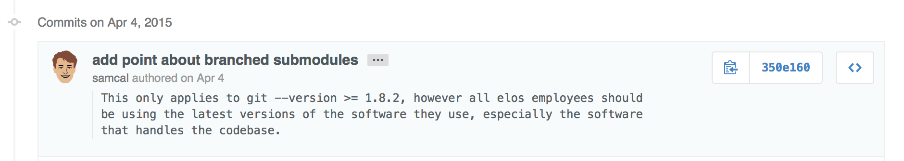

Git
===

Commits
-------

Commit messages should be succinct (less than 80 characters).

Write commit messages in the present tense, lower case.

i.e., `add the ability to create a user`

This is the only correct format, past tense is never needed. Anything without an action verb is vague.
Think about applying changesets (commits) as actions, each commit changes the code in some way.

When more information is needed, supply it as bullets in the details of the commmit messages. Always cap at three bullets

i.e.,

```
    add ability to create a user

    * I needed to rework the database connection for this
    * Still need to do proper error handling
    * Will think more about live updates
```

(Your commits will never be so incomplete, else they certainly only exist on a separate branch.)

##### For Example:


Branching
---------

Always work in a branch and rebase aggresively.

Naming:

  `<github_username>/<feature>`


Creating a new branch:

  ```bash
     git checkout -b <branch_name>
  ```

Switching between branches:

   ```bash
     git checkout <branch_name>
   ```

Deleting Branches:

   ```bash
     git branch -D <branch_name>
   ```

Rebasing
--------

Rebasing replaces merging. Merges are sloppy, uncoordinated, and reproduce diff history.

Rebasing is especially useful for branch-based development.

When you checkout a new branch from master, the split of the commit history occurs at the current HEAD of the master branch (the most recent commit).

Over time, as you work on another branch, master will advance as team members add commits. and your branch will become stale (n commits behind master).

Rebasing takes your commits applied since the initial checkout, re-checks out master at it's current HEAD, and then applies your changesets sequentially to the new state of the master branch.

Benefits
  * Keeps commit history clean
  * Allows for problem solving of conflicts on a per-commit basis
  * Keeps your feature branches up to date, and prevents the punctual interruptions of "Merged master into <branch_name>" commits

Rebasing a branch on master:

  ```bash
    git rebase origin/master
  ```

Interactive rebases are especially useful:

  ```bash
    git rebase -i origin/master
  ```

You will be presented with different options, among them squashing commits together, discarding commits, and fixing commit messages.

Interactive rebasing contributes to the goal of clean commit history, and effective merges to master. Your commit behavior can be frequent on the separate branch, and you can distill the essential progress upon rebase.

Rebase aggresively against master when working on separate branches.

Merging to Master
----------------

The only merging ever needed will be from a feature branch into the master branch. Always use the `--ff-only` flag

 1. rebase your branch on master (interactively to clean up your commit history)

    ```bash
      git fetch origin/master
      git rebase -i origin/master
    ```
 2. checkout your local master branch, make sure it is up to date with origin/master as well

    ```bash
      git checkout master
      git pull origin master
    ```
 3. now you can _merge_ your commits, using --ff-only (fast-forward only)

    ```bash
      git merge <branch_name> --ff-only
    ```

Fast forward merges (`ff-only`) apply the commits on your feature branch sequentially to master.

Effectively the counterpart of a rebase, the fast-forward merge requires no commit, and does not reproduce changesets.

Submodules
----------

A submodule is the correct way to embed one git repository into another. Git tracks the correct version of the foreign repository, and allows for simple updates. To add a submodule:

  ```bash
    git submodule add <repository> <path>
    git submodule update --init --recursive
  ```

Where `<repository>` is the location of the repository (via https, git, or ssh), and `<path>` is the relative path that will contain the submodule.

A fresh clone of your repository will not include the submodules, so it requires an `update`:

  ```bash
    git submodule update --init --recursive
  ```

In order to update a submodule, treat it as its own git repository:

  ```bash
    cd <path>
    git pull --rebase origin master
  ```

Since we can treat the submodule as its own git repository, we can also do things like checking out different branches of the repo:

```bash
    cd <path>
    git fetch && git checkout new-feature-branch

    # or, simply do this when adding the submodule:
    # git submodule add -b <branch-name> <repository> <path>
```

The parent repository will track the changes to the submodule, make sure that you commit that you've updated the submodules:

  ```bash
    git commit -m 'update <submodule_name>'
  ```
